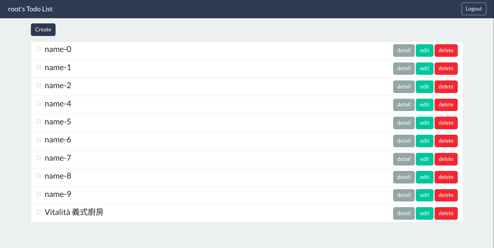
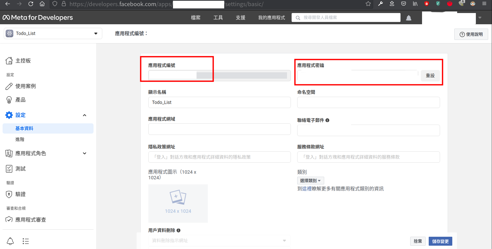
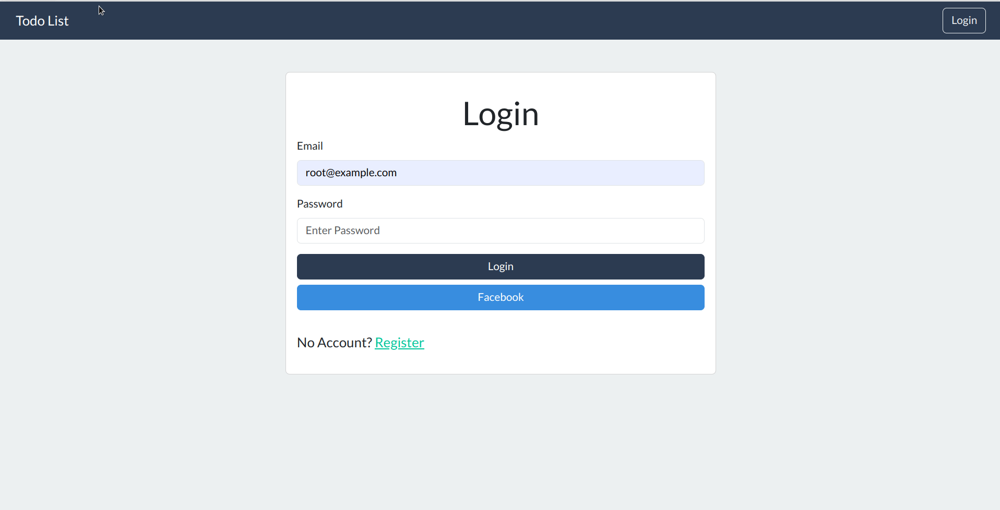
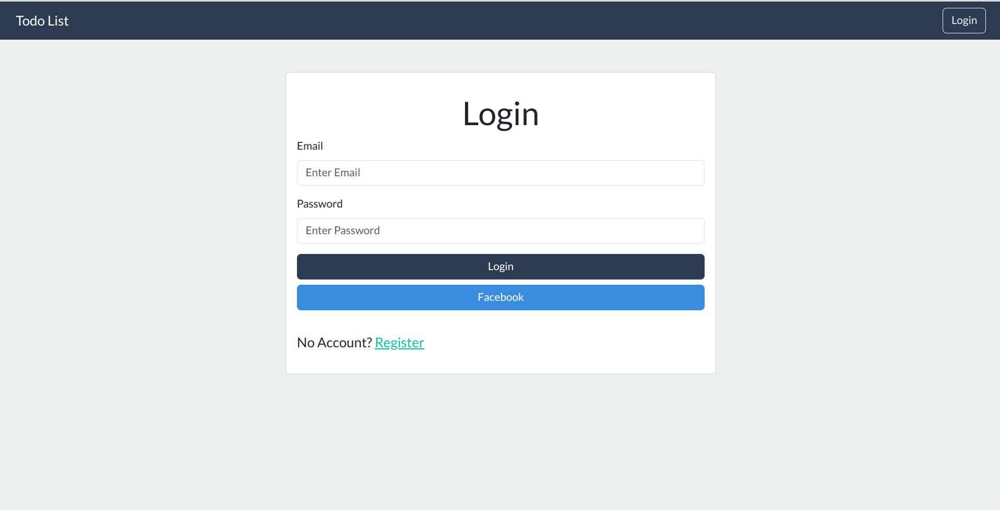
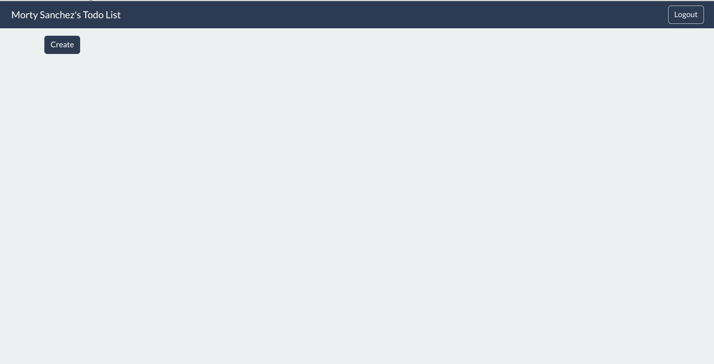
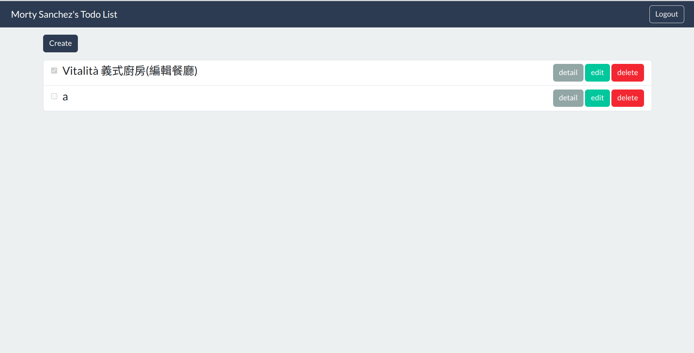
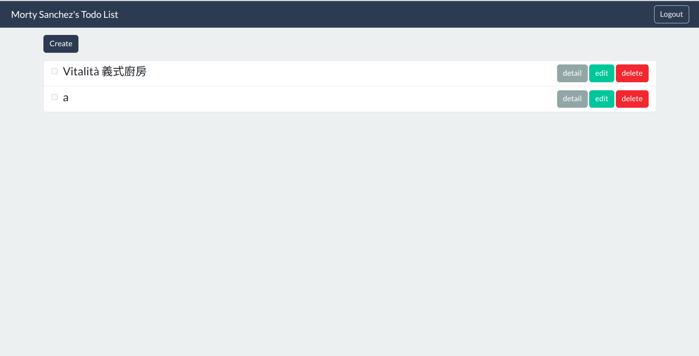

# todo-sequelize
## 簡介
此專案為練習使用MySQL搭配Node.js的Sequelize套件，並實做CRUD功能與RESTful風格router，功能較為粗糙。
## Demo - 專案畫面


## Features - 產品功能
- Login/Register
    - 未登入前進入主畫面會被導回登入頁面，並出現警示訊息要求登入
    - 可使用email與密碼註冊帳號，密碼經過bcrypt加密儲存於MySQL
    - 可使用Facebook註冊與登入
    - 註冊時未填寫email或密碼與確認密碼不相符會有警示資訊
    - 登入時email與密碼不相符會出現警示訊息
- CRUD
    - 新增新todo項目
    - 查看todo項目
    - 編輯todo項目並標記為完成(也可取消)
    - 刪除todo項目，delete時使用soft delete，檔案仍會保存於資料庫但標示deletedAt的時間點
## Installing - 專案安裝流程

1. 請先確認有安裝 node.js 、 npm 與 MySQL
2. 創造一個專案資料夾，打開您的 terminal，使用`cd`指令進入您剛創建的資料夾
3. Clone 此專案至本機電腦將專案 clone 到本地
    ```Bash
    git clone https://github.com/TinyMurky/expense-tracker.git
    ```
4. CD進入您剛剛建立的資料夾，輸入以下指令自動安裝所需套件
    ```Bash
    npm install
    ```
5. 請先確認您的電腦已安裝MySQL，並執行以下指令安裝`mysql2`、`sequelize`、`sequelize-cli`
    ```Bash
    npm install mysql2 sequelize sequelize-cli
    ```
6. 請於MySQL中輸入以下SQL指令
    ```SQL
    drop database if exists todo_sequenlize;
    create database todo_sequenlize;
    use todo_sequenlize;
    ```
7. 請前往專案資料夾下的 `config/config.json.example` 之檔名更改為`config/config.json`，並更改檔案中 `username`與`password`
    ```JSON
    "development": {
        "username": "請把我改成您的mysql帳號名(ex:root)",
        "password":"請把我改成您的mysql密碼(ex:password)",
        "database": "todo_sequenlize",
        "host": "127.0.0.1",
        "dialect": "mysql"
        },
    ```
8. 終端機位於專案路徑時輸入以下指令建立database
    ```Bash
    npx sequelize db:migrate
    ```
9. 終端機位於專案路徑時輸入以下指令建立預設seeder資料
    ```Bash
    npx sequelize db:seed:all
    ```
    seed提供2組預設帳號可供登入，內有測試用todo項目
    
    ||Name|Email|Password|
    |:--|:--|:--|:--|
    |1|root|root@example.com|12345678|
    |2|user1|user1@example.com|12345678|
10. 我們需要建立.env檔設定環境變數，根目錄檔案`.env.example`可以看到示範檔案，如下所示，填寫
    ```
    FACEBOOK_APP_ID = 您的Facebook developer 應用程式編號
    FACEBOOK_APP_SECRET = 您的Facebook developer 應用程式密鑰
    FACEBOOK_CALLBACK = http://localhost:3000/auth/facebook/callback
    PORT = 3000
    SECRET_WORD = CreateYourOwnSecretWords
    ```
    - FACEBOOK_APP_ID, FACEBOOK_APP_SECRET 請於[meta for developer](https://developers.facebook.com/)申請一組應用程式編號與應用程式密鑰
    
11. 上述步驟都完畢後，繼續於終端機輸入：
    ```
    npm run start
    ```
12. 若看見此行訊息則代表順利運行，打開瀏覽器進入到以下網址:
    ```
    Sever start at PORT:3000
    ```
13. 若欲暫停請於終端機使用:
    ```
    ctrl + c
    ```
## 登入功能展示
### 註冊帳戶
可於註冊頁面註冊帳戶後於登入畫面登入

### 未登入阻擋
未登入的狀態嘗試進入主畫面，將被導回登入畫面並提示訊息

### 註冊與登入輸入錯誤提示
於註冊或登入頁面輸入錯誤資訊將有提示訊息

### 可使用第三方註冊與登入
可使用Facebook進行登入

### 登出功能
進入主畫面後可於右上角選擇登出功能


## CRUD功能展示
### Create 新增一筆todo

### Read 看一筆todo的Detail

### Update 修改一筆todo

### Delete刪除一筆todo
Delete時使用soft delete，檔案仍會保存於資料庫但標示deletedAt的時間點

## Environment SetUp - 環境建置
- By NPM
    - bcryptjs: 2.4.3
    - connect-flash: 0.1.1
    - dotenv: 16.0.3
    - express: 4.18.2
    - express-handlebars: 7.0.7
    - express-session: 1.17.3
    - local: 0.3.3
    - method-override: 3.0.0
    - mysql2: 3.4.5
    - passport: 0.6.0
    - passport-facebook: 3.0.0
    - passport-local: 1.0.0
    - sequelize: 6.32.1
    - sequelize-cli: 6.6.1
- NPM 單獨安裝
- Other Resources
    - MySQL
    - bootstrap 5.3.0
    - bootswatch Flatly
## 開發人員
- TinyMurky
- Alpha Camp